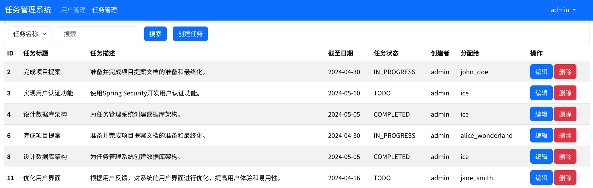

# 任务管理系统

## 基本功能介绍

1. 用户管理模块：
   
   - 用户列表展示：显示系统中所有用户的列表，包括用户名、角色等信息。
   
   - 添加用户：管理员权限下可添加新用户。
   
   - 编辑和删除用户：管理员权限下可编辑用户信息（如密码重置、角色修改）和删除用户。

2. 任务管理模块：

   - 任务列表展示：显示所有任务的列表，包括任务标题、截止日期、状态等信息。

   - 创建任务：允许用户创建新的任务，包括填写任务标题、描述、截止日期等信息。

   - 查看和编辑任务：用户可以查看和编辑自己创建的任务，包括修改任务内容和状态。

   - 分配任务：管理员权限下可以将任务分配给其他用户。

     

## 数据库表结构设计

1. 任务表(Task)

   ```sql
   CREATE TABLE task (
       id INT PRIMARY KEY AUTO_INCREMENT,
       title VARCHAR(255) NOT NULL,
       description TEXT,
       deadline DATE,
       status ENUM('TODO', 'IN_PROGRESS', 'COMPLETED') DEFAULT 'TODO',
       creatorId INT NOT NULL,
       assigneeId INT,
       createdAt TIMESTAMP DEFAULT CURRENT_TIMESTAMP,
       updatedAt TIMESTAMP DEFAULT CURRENT_TIMESTAMP ON UPDATE CURRENT_TIMESTAMP,
       FOREIGN KEY (creatorId) REFERENCES user(id),
       FOREIGN KEY (assigneeId) REFERENCES user(id)
   );
   ```

   **字段说明**：

   - `id`: 任务ID，主键，自动递增。
   - `title`: 任务标题，必填。
   - `description`: 任务描述，可以是文本。
   - `deadline`: 截止日期。
   - `status`: 任务状态，可以是待办（TODO）、进行中（IN_PROGRESS）、已完成（COMPLETED）。
   - `creatorId`: 创建者（任务的发布者）的用户ID，外键关联到用户表。
   - `assigneeId`: 被分配任务的用户ID，外键关联到用户表。
   - `createdAt`: 任务创建时间。
   - `updatedAt`: 任务更新时间。

2. 用户表（User)

   ```sql
   CREATE TABLE user (
       id INT PRIMARY KEY AUTO_INCREMENT,
       username VARCHAR(50) UNIQUE NOT NULL,
       password VARCHAR(255) NOT NULL,
       email VARCHAR(100) UNIQUE NOT NULL,
       role ENUM('USER', 'ADMIN') DEFAULT 'USER',
       createdAt TIMESTAMP DEFAULT CURRENT_TIMESTAMP,
       updatedAt TIMESTAMP DEFAULT CURRENT_TIMESTAMP ON UPDATE CURRENT_TIMESTAMP
   );
   ```

   **字段说明**：

   - `id`: 用户ID，主键，自动递增。
   - `username`: 用户名，唯一，用于登录。
   - `password`: 密码，加密存储。
   - `email`: 用户邮箱，唯一。
   - `role`: 用户角色，可以是普通用户（USER）或管理员（ADMIN）。
   - `createdAt`: 用户创建时间。
   - `updatedAt`: 用户信息更新时间。

   **表结构说明：**

   - `task` 表和 `user` 表之间使用外键关联（`creatorAd` 和 `assigneeAd`）来建立任务和用户之间的关系。
   - 用户表中的 `role` 字段可以用来区分普通用户和管理员，判断用户的权限。

## 项目界面预览

1. 登录页面

    

2. 后台首页

    